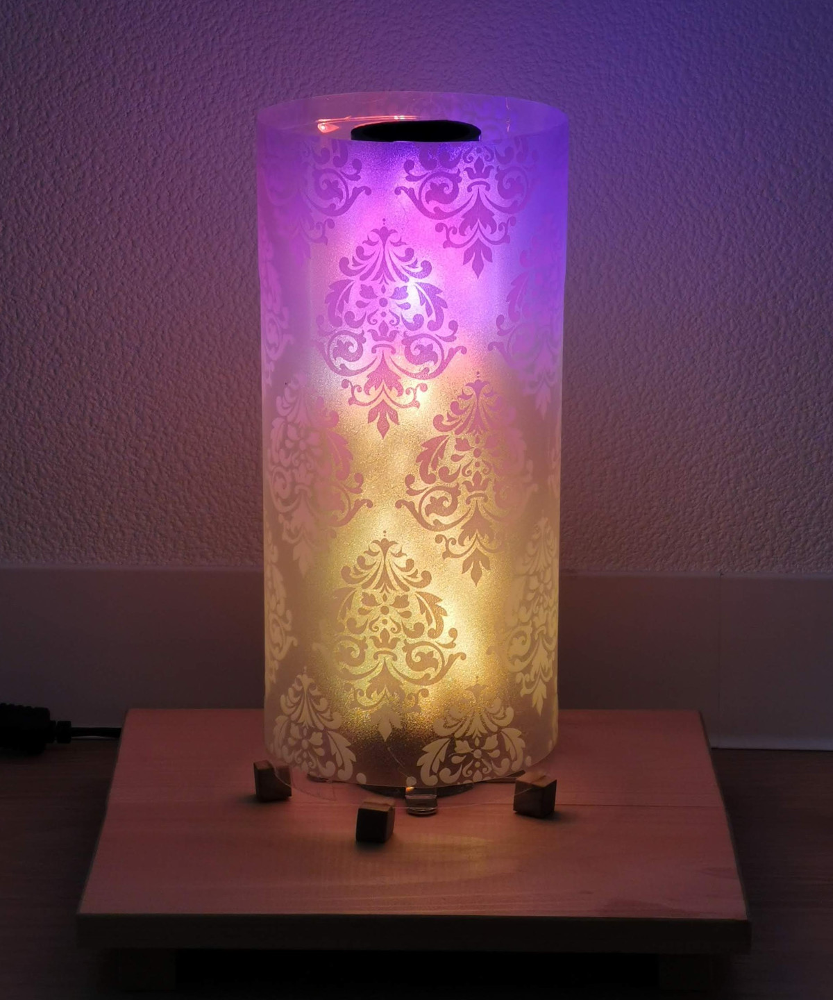
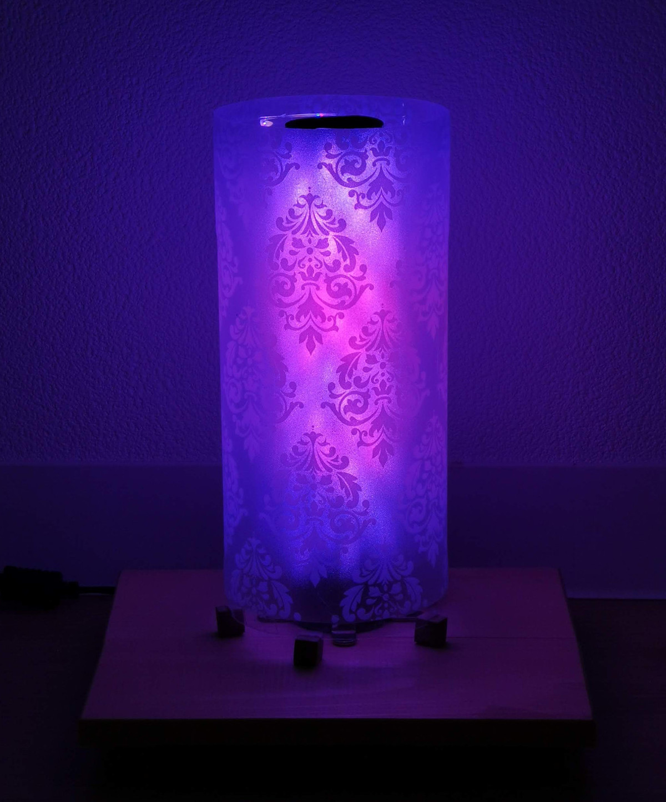
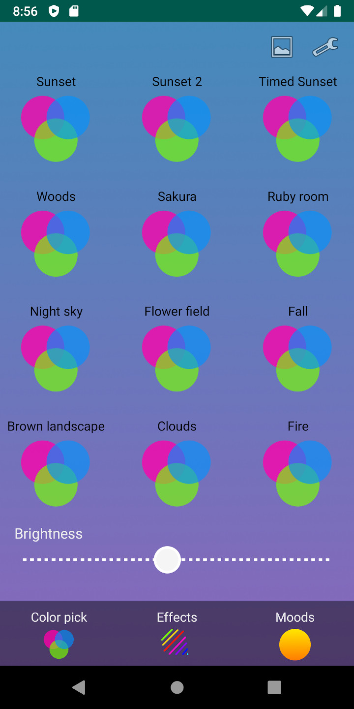
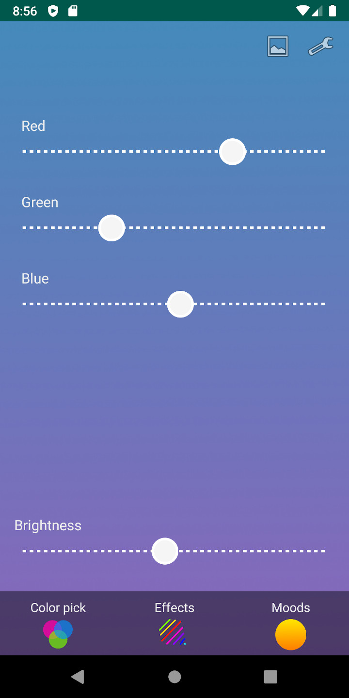
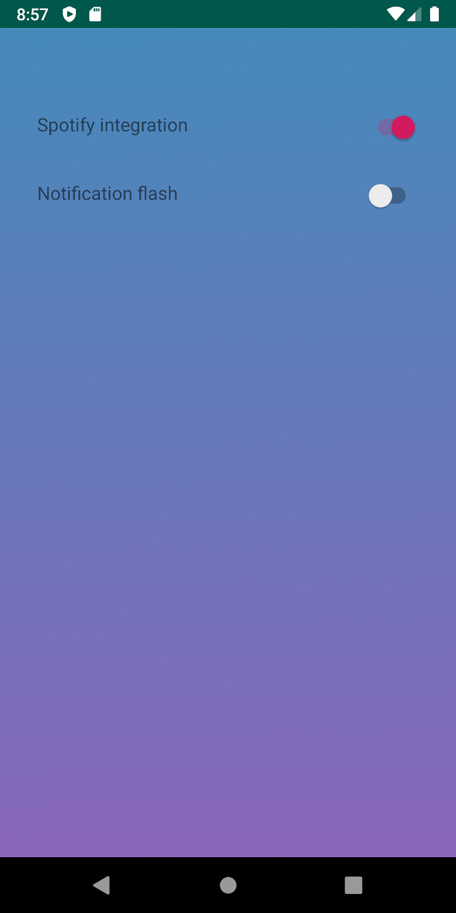

# ESP32 Bluetooth LED Lamp

For a description of how the actual lamp was built see [https://miksto.github.io/led-lamp/](https://miksto.github.io/led-lamp/)

## Features
- Spotify integration. Sets the lamp to a color matching the album art. Similar to how the color of the spotify status bar notification is picked.

- Pick an image from the phone and display it on the lamp.

- Flash lamp whenever the phone receives a new notification, such as when messages, emails etc. are received.

- Various animated effects and mood effects. Night sky, green forest and sunset to name a few.

- Simple RGB color picker in the app.

## The lamp itself

## App screenshots

